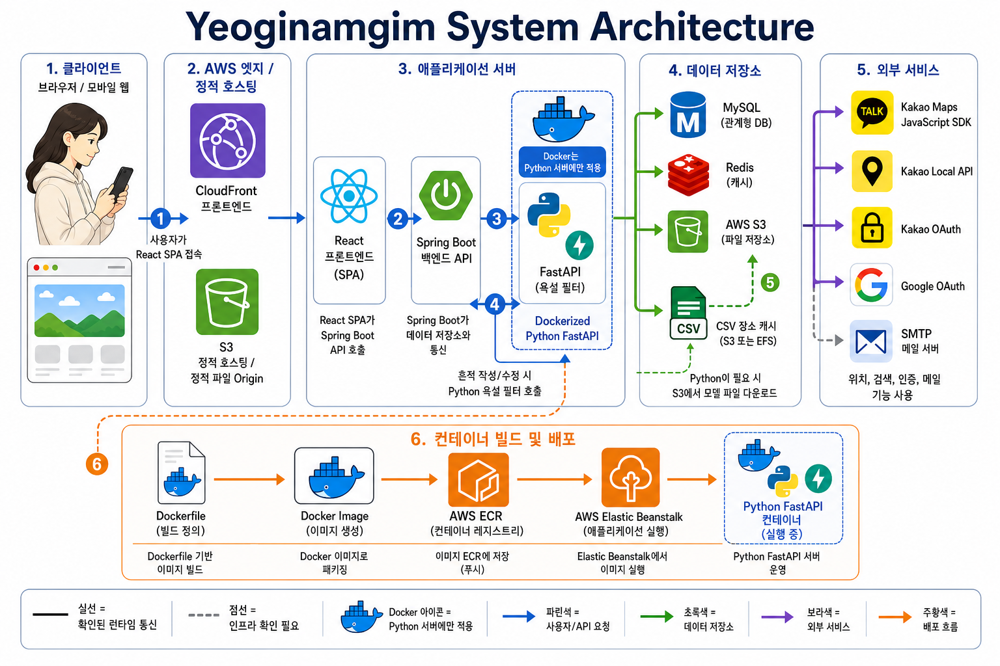

## 4. 서비스 아키텍처

본 서비스는 사용자가 웹 또는 모바일 환경에서 React 기반 클라이언트에 접속하면, AWS CloudFront와 S3 정적 호스팅을 통해 프론트엔드 화면을 제공하는 구조입니다.  
클라이언트는 Spring Boot 백엔드 API와 통신하며, 필요한 경우 FastAPI 기반 Python 서버를 호출하여 욕설 필터링 기능을 수행합니다.

데이터는 MySQL, Redis, AWS S3를 통해 관리되며, 지도, 검색, 로그인, 메일 기능은 Kakao 및 Google OAuth, Kakao Local API, Kakao Maps SDK, SMTP 서버와 연동하여 처리합니다.  
Python FastAPI 서버는 Docker 이미지로 빌드된 후 AWS ECR에 저장되고, AWS Elastic Beanstalk를 통해 컨테이너 환경에서 실행됩니다.

## 5. 시연영상 링크

- [시연영상 보러가기](https://www.youtube.com/watch?v=tKTGVVTD5zw)

## 6. 참고 링크

- [프로젝트 배포 링크](https://d3vvhygufn2oi5.cloudfront.net/splash)
- [GitHub Repository](깃허브_링크를_입력해주세요)
- [API 문서 / 참고 자료](참고_링크를_입력해주세요)
